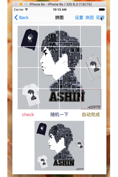
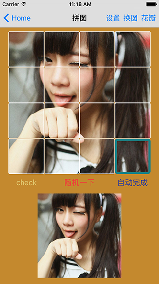

现学现做的第一个swift版本拼图游戏demo

常规模式，对换模式任你选择，

用到了花瓣的API，各种萌妹子~😄😄 让你一次看不够

用到的库：

+ [Alamofire](https://github.com/Alamofire/Alamofire)
+ [Kingfisher](https://github.com/onevcat/Kingfisher)
+ [MJRefresh](https://github.com/CoderMJLee/MJRefresh)
+ [SwiftyJSON](https://github.com/search?utf8=%E2%9C%93&q=SwiftyJSON)

######另外请忽略这没有设计感的UI

持续更新中...

   

